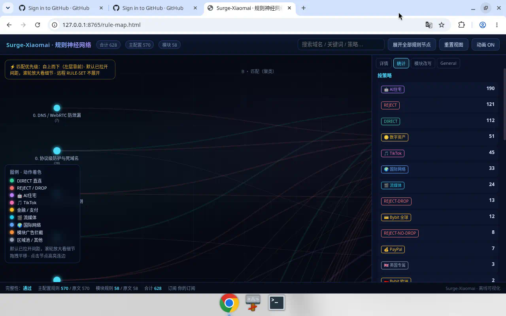

<p align="right">
  <a href="#english"><b>English</b></a> · <a href="#中文">中文</a>
</p>

# Surge-Diversion-Rules

<p align="center"><a href="./index.html"><b>Open single-language description page (EN / 中文)</b></a></p>

Technical notes on **Surge policy / rule design** by Xiaomai (discussion and study only).

> **Disclaimer / 声明**
>
> This repository is for **rule-setting discussion and technical exchange only**.
> It is **not** sharing of proxy access, **not** promotion of any VPN/airport/service, and **not** an offer to provide connectivity.
> No live subscription URLs, nodes, or accounts are included. Placeholders such as `你的订阅` must be filled with **your own** lawful resources.
> You are responsible for complying with GitHub terms and the laws where you live. This is not legal advice.
>
> 本仓库仅用于**规则设定交流与技术讨论**。
> **不是**分享可用代理接入，**不是**推广任何 VPN/机场/服务，**也不是**向他人提供连接。
> 不含真实订阅链接、节点或账号。占位符需自行替换为**你有权使用**的资源。
> 请自行遵守 GitHub 条款及所在地法律法规。本文不构成法律意见。

**Rule-flow idea (technical):** DNS/leak controls and ad rejects first → finance / AI identity policies → domestic DIRECT → streaming and social policy groups → FINAL fallback.

---

<a id="english"></a>
## English *(default)*

### Purpose

Discuss how a Surge profile can structure **policy groups** and **match order** (ads, finance, AI, domestic DIRECT, streaming, etc.).
Artifacts here are **configuration examples for study**, not a packaged service.

### Routing logic (short)

Rules match **top to bottom**:

1. **Protect and clean** — DoH/DoT / STUN related rejects; ad/tracker rejects with allowlists.
2. **Finance-related policies** — example splits by region policy groups (EU / TW / UK / PayPal labels).
3. **AI and identity-related policies** — example grouping for AI product domains and shared challenge/telemetry hosts.
4. **TikTok-related policy** — example Smart group filtered by node name patterns.
5. **Domestic and LAN** — domestic apps / Apple CN-CDN / NTP / China IP / GEOIP → DIRECT.
6. **Streaming-related policies** — example sets for YouTube / Netflix / regional stream lists.
7. **General international policies** — example sets for chat / GitHub / global lists.
8. **FINAL** — fallback policy (`dns-failed` aware).

These names are **labels in a sample profile**, not recommendations to buy or use any provider.

### Rule map (preview)



> GitHub README cannot run JavaScript.
> - Single-language description page: [`index.html`](./index.html) (centered title + EN/中文 switch; only one language shown).
> - Interactive rule map: [`rule-map.html`](./rule-map.html).

### Files (examples)

| File | Role |
|------|------|
| [`index.html`](./index.html) | Description page (one language at a time) |
| [`rule-map.html`](./rule-map.html) | Interactive map of the sample rule graph |
| `Surge-Xiaomai.conf` | Sample Surge profile (placeholders only) |
| `Surge-Xiaomai-AdBlock.sgmodule` | Sample ad-related module |
| `assets/rule-map-preview.png` | README preview image |

### Personalizing the sample (your own resources)

1. Replace `你的订阅` on `policy-path` with a subscription **you already own** and are allowed to use.
2. Replace `your-subscribe-host.example` with **your** subscribe host for DIRECT, if needed.
3. Import into Surge only if that use is lawful for you.
4. Open `index.html` for the description UI, or `rule-map.html` for the interactive graph.

### Agent prompts (optional helpers)

For rewriting **your own** placeholders—not for obtaining access from anyone.

#### A) Chat-driven

```text
Customize this sample Surge profile for my own already-owned subscription.
Files: Surge-Xiaomai.conf, Surge-Xiaomai-AdBlock.sgmodule, rule-map.html.
1) Replace 你的订阅 with MY_OWN_SUBSCRIPTION_URL
2) Replace your-subscribe-host.example with MY_OWN_HOST
3) Do not change policy logic unless I ask
4) Output the full modified files. Do not invent nodes or provide access.
```

#### B) Write files into a local folder

```text
Open this sample repo.
Replace policy-path=你的订阅 with my own URL.
Replace your-subscribe-host.example with my own host.
Write ./dist/Surge-Xiaomai.personalized.conf and copy the sgmodule to ./dist/
Summarize placeholder replacements only. Do not commit/push unless I ask.
```

### Notes on other clients (e.g. Shadowrocket)

Different clients use different config dialects. Any conversion here means **format study** of match rules you already have rights to use—not providing a proxy service.

- Client subscription fields only accept **your** provider URL.
- Smart / MITM / Script features in Surge may not map 1:1; expect dropped modules.
- Optional Agent ask: Translate DOMAIN/IP/GEOIP/FINAL from this sample into another client rule syntax; list dropped features; do not add nodes.

---

<a id="中文"></a>
## 中文

### 用途说明

本仓库用于讨论 Surge **策略组与规则匹配顺序**（去广告、业务策略、国内直连、流媒体策略等）的**规则设定交流与技术学习**。
内容是**配置样例**，不是代理服务、不是机场推广、也不是向他人提供可用连接。

### 分流逻辑（简要）

规则**自上而下**匹配：

1. **防护与清理** — 与 DoH/DoT、STUN 等相关的拒绝；广告/追踪拒绝（含白名单取舍）。
2. **金融相关策略** — 样例中按地区策略组划分（欧/台/英/PayPal 等标签）。
3. **AI 与身份相关策略** — 样例中对 AI 域名与共用验证/遥测主机的归组方式。
4. **TikTok 相关策略** — 样例 Smart 组与节点名过滤写法。
5. **国内与局域网** — 国内应用 / Apple 国内 CDN / NTP / 国内 IP / GEOIP → 直连。
6. **流媒体相关策略** — YouTube / Netflix 及分区列表等样例。
7. **一般国际策略** — 通讯 / GitHub / 全球列表等样例。
8. **FINAL** — 兜底策略（含 `dns-failed`）。

以上名称仅为**样例标签**，不构成对任何服务商的推荐或推广。

### 规则图（预览）


> GitHub 描述页不能运行脚本。
> - 单语言描述页：[`index.html`](./index.html)（标题居中 + EN/中文切换，一次只显示一种语言）
> - 交互规则图：[`rule-map.html`](./rule-map.html)

### 文件（样例）

| 文件 | 作用 |
|------|------|
| [`index.html`](./index.html) | 描述页（同一时间只显示一种语言） |
| [`rule-map.html`](./rule-map.html) | 样例规则拓扑交互图 |
| `Surge-Xiaomai.conf` | Surge 配置样例（仅占位符） |
| `Surge-Xiaomai-AdBlock.sgmodule` | 去广告相关模块样例 |
| `assets/rule-map-preview.png` | 本页预览图 |

### 自行替换占位符（仅限你有权使用的资源）

1. 将 `policy-path` 的 `你的订阅` 换成**你自己已有、且有权使用**的订阅。
2. 按需将 `your-subscribe-host.example` 换成你的订阅域名。
3. 仅在你自身合法合规的前提下导入 Surge。
4. 打开 `index.html` 看描述页，或打开 `rule-map.html` 看交互图。

### Agent 提示词（可选）

用于改写**你自己的**占位符，不是让任何人提供接入。

#### A) 对话式

```text
请把该 Surge 规则样例改成我自己已有订阅可用的配置。
文件：Surge-Xiaomai.conf、Surge-Xiaomai-AdBlock.sgmodule、rule-map.html。
1) 「你的订阅」→ 我自己的订阅 URL
2) your-subscribe-host.example → 我自己的域名
3) 不改策略逻辑，除非我另说
4) 输出完整文件。不要编造节点，不要提供任何代理服务。
```

#### B) 直接写出结果文件

```text
打开本样例仓库。
用我自己的订阅 URL 替换 policy-path=你的订阅。
用我自己的域名替换 your-subscribe-host.example。
写出 ./dist/Surge-Xiaomai.personalized.conf，并复制 sgmodule 到 ./dist/
只汇报占位符替换摘要。未经允许不要 commit/push。
```

### 关于其他客户端（如 Shadowrocket）

不同客户端配置方言不同。所谓转换仅指**规则写法学习/格式对照**，不是提供代理或推广任何服务。

- 订阅字段只能填**你自己**的来源。
- Surge 的 Smart / MITM / 脚本等可能无法一一对应，需接受功能删减。
- 可选请 Agent：把样例中的 DOMAIN/IP/GEOIP/FINAL 转成另一客户端规则语法，列出无法对应的部分；不要添加节点。

